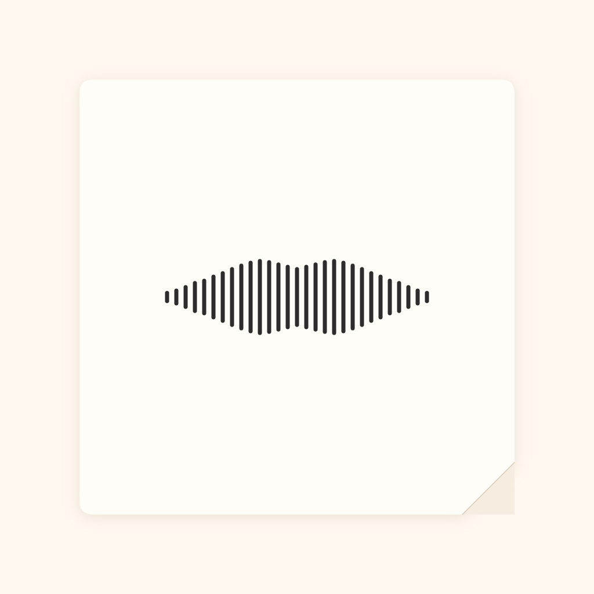

<p align="center">
  
</p>

<h1 align="center">Jottr</h1>

<p align="center">
  <strong>Voice dictation that rewrites in your voice — not AI's.</strong><br>
  Press a key. Speak. Release. Your words appear, cleaned up exactly as much as you want.
</p>

<p align="center">
  <a href="https://github.com/RamenFN/jottr/releases/latest/download/Jottr.dmg"><strong>⬇ Download Jottr.dmg</strong></a>
  &nbsp;·&nbsp;
  <a href="#build-from-source">Build from source</a>
  &nbsp;·&nbsp;
  <a href="https://console.groq.com/keys">Get a free Groq key</a><br>
  <sub>macOS 13.0+ &nbsp;·&nbsp; Apple Silicon + Intel &nbsp;·&nbsp; Free &amp; open source</sub>
</p>

---

## What it does

Hold a hotkey → speak → release. Jottr transcribes your voice and rewrites it, then pastes directly wherever your cursor is. No app switching, no clipboard fumbling, no dictation mode.

The rewriting is the part that makes it different.

### Four intensity levels

| Level | What it does |
|-------|-------------|
| **L1 — Fix** | Corrects transcription errors and filler words only. Your words, your structure, just cleaned up. |
| **L2 — Cleanup** | Smooths out the roughness of spoken language without restructuring anything. |
| **L3 — Rephrase** | Rewrites sentences for clarity while keeping the order of your ideas. |
| **L4 — Restructure** | Takes a stream-of-consciousness brain dump and turns it into coherent prose. |

Switch levels instantly from the menu bar or with `Option+1/2/3/4` — no settings window required.

### Built-in anti-slop rules

Every level blocks the tells that make AI writing recognizable: em-dash overuse, filler openers ("Certainly!", "Great question!"), inflated vocabulary ("utilize", "leverage", "delve into"), and unearned bullet-point structure. Output sounds like you wrote it because the rules are written to enforce that.

### Voice snippets

Define trigger phrases that expand to longer text. Say "my email" → your email address. Say "sign off" → your standard closing paragraph. Snippets are applied before the rewriting step, so the LLM treats expanded text as your own words and won't rephrase it away.

### Everything else

- **Groq-powered** — Whisper large-v3 for transcription, Llama 4 Scout for rewriting. Fast and free-tier-friendly.
- **Persistent settings** — intensity level, custom per-level prompts, snippet library, all survive restarts.
- **Context-aware** — captures active app, window title, and selected text to give the LLM relevant context.
- **Dock + menu bar** — settings window accessible from either; comes to the foreground even behind full-screen apps.
- **Your key, your data** — no subscription, no telemetry. The only network calls are to Groq.

---

## Install

1. Download [Jottr.dmg](https://github.com/RamenFN/jottr/releases/latest/download/Jottr.dmg)
2. Drag Jottr to Applications
3. Right-click → **Open** on first launch (required for ad-hoc signed apps)
4. Get a free API key from [console.groq.com/keys](https://console.groq.com/keys) — free tier covers heavy personal use
5. Paste the key in the setup wizard and grant microphone + accessibility permissions

**Requirements:** macOS 13.0 (Ventura) or later.

---

## Build from source

```bash
git clone https://github.com/RamenFN/jottr.git
cd jottr
make
make run
```

Requires Xcode Command Line Tools:

```bash
xcode-select --install
```

### Run tests

```bash
swift test
```

### Release build

The CI pipeline builds a universal (arm64 + x86_64) ad-hoc signed DMG on every version tag push:

```bash
git tag -a v1.0.1 -m "v1.0.1"
git push origin v1.0.1
```

GitHub Actions picks it up and publishes a release with `Jottr.dmg` attached.

---

## Attribution

Built on [FreeFlow](https://github.com/zachlatta/freeflow) by [@zachlatta](https://github.com/zachlatta). The audio capture, transcription pipeline, and paste mechanics are from FreeFlow. Everything from the intensity system forward is new.

## License

MIT
